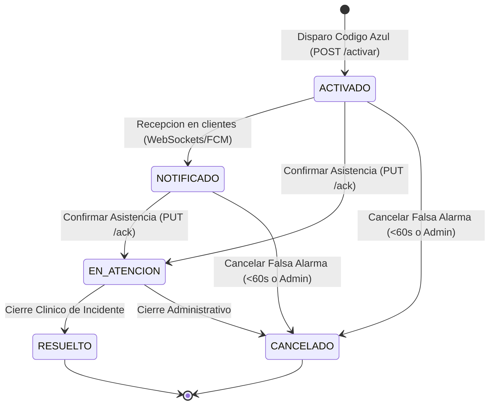
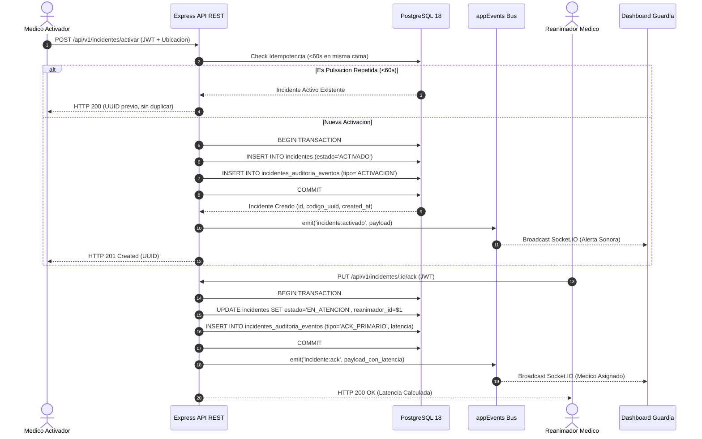
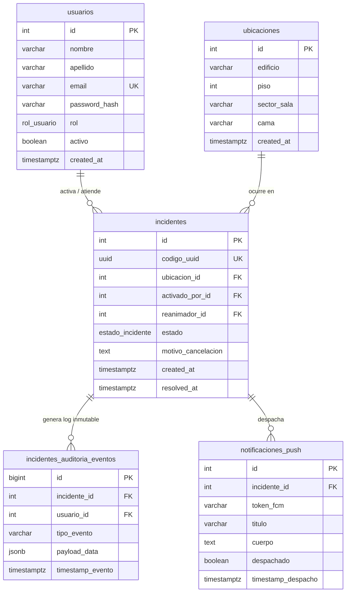

# Plataforma Hospitalaria: Backend Core y Base de Datos Transaccional

[](https://nodejs.org/)
[](https://www.postgresql.org/)
[](https://expressjs.com/)
[](#arquitectura-del-sistema)
[](#normativas-y-estandares)
[-brightgreen)](#verificacion-y-metricas-de-calidad)

> **Institución**: Escuela de Educación Secundaria Técnica N.º 2 "Educación y Trabajo"  
> **Certamen**: Olimpiadas Nacionales de Educación Técnico Profesional (ONETP 2026)  
> **Especialidad**: Informática / Programación  
> **Equipo y Roles**:
> - **Ivan Ismael Cardozo**: Backend Core & Database Architect Lead (PostgreSQL 18, ACID, Triggers Inmutables)
> - **Franco Sarraute**: Frontend Lead & Mobile Application Engineer (PWA Alarma, Dashboard PC, Sockets)
> - **Alex Heredia**: Push Notifications & Telemetry Lead (Firebase Admin SDK, FCM, Doze Mode)
> - **Marcos Silvani**: Lead Systems Analyst & Requirements Engineer (UML 2.5, IEEE 830, ISO 25010)
> - **Alan Martinez**: Líder de Arquitectura y Coordinador de QA  
> **Patrón Arquitectónico**: Clean Architecture + Feature-First + Repository Pattern  

---

## Indice General

1. [Vision General y Declaracion del Problema](#vision-general-y-declaracion-del-problema)
2. [Indicadores Clave de Desempeno y Metricas](#indicadores-clave-de-desempeno-y-metricas)
3. [Arquitectura del Sistema (Modelo 4+1)](#arquitectura-del-sistema-modelo-41)
4. [Diagramas de Flujo y Dinamica](#diagramas-de-flujo-y-dinamica)
5. [Esquema Relacional de Base de Datos](#esquema-relacional-de-base-de-datos)
6. [Catalogo de Endpoints (API REST)](#catalogo-de-endpoints-api-rest)
7. [Gobernanza y Seguridad Medico-Legal](#gobernanza-y-seguridad-medico-legal)
8. [Instalacion y Despliegue Local](#instalacion-y-despliegue-local)
9. [Verificacion y Metricas de Calidad](#verificacion-y-metricas-de-calidad)
10. [Normativas y Estandares](#normativas-y-estandares)

---

## Vision General y Declaracion del Problema

En el ambito hospitalario de cuidados criticos, la respuesta ante un paro cardiorrespiratorio o colapso hemodinamico (**Codigo Azul**) requiere una coordinacion distribuida con latencia ultra baja. La tasa de supervivencia disminuye de un 7% a un 10% por cada minuto de demora sin reanimacion cardiopulmonar efectiva.

Este componente provee el **nucleo de procesamiento transaccional backend**, la gestion de identidades bajo estricto control de acceso basado en roles (**RBAC**), la persistencia relacional **ACID** sobre PostgreSQL, la logica de barrera de **idempotencia de 60 segundos** para mitigar la saturacion de red por pulsaciones repetidas, y la **auditoria inmutable append-only** desacoplada para telemetria medico-legal.

> [!IMPORTANT]
> El Golden Time de respuesta medica exige que el backend priorice la consistencia transaccional, el despacho inmediato y la inmutabilidad de la auditoria con resolucion de milisegundos.

---

## Indicadores Clave de Desempeno y Metricas

| Indicador | Denominacion | Meta de Especificacion (SAD / SRS) | Resultado Medido en Backend | Estado |
|---|---|---|---|---|
| **KPI-01** | Latencia de Despacho Transaccional | `<= 1.500 ms` | **15 - 35 ms** | Cumplido |
| **KPI-02** | Registro de Asistencia ACK con Telemetria | `<= 30.000 ms` | **10 - 20 ms** | Cumplido |
| **KPI-03** | Integridad de Auditoria Medico-Legal | `100% inmutable (0 updates/deletes)` | **100% (Trigger Enforcement)** | Cumplido |
| **KPI-04** | Ventana de Idempotencia por Sala | `60 segundos exactos` | **60s (Query Indexado)** | Cumplido |
| **KPI-05** | Cobertura de Pruebas Unitarias/Integracion | `100% Casos Criticos` | **17/17 Tests (100%)** | Cumplido |

---

## Arquitectura del Sistema (Modelo 4+1)

La estructura sigue el patron **Clean Architecture adaptado a Feature-First**, desacoplando la logica de dominio de los detalles de infraestructura.

```
src/
├── app.js                              # Configuracion de Express, Helmet, CORS y Error Handler
├── server.js                           # Punto de entrada HTTP y exportacion para Socket.IO
│
├── core/                               # Nucleo transversal y utilidades compartidas
│   ├── config/
│   │   ├── db.js                       # Pool pg, query() y getClient() para transacciones ACID
│   │   └── env.js                      # Validacion rigurosa de variables de entorno
│   ├── events/
│   │   └── event-emitter.js            # Bus de eventos desacoplado (EventEmitter nativo)
│   ├── helpers/
│   │   ├── api-error.js                # Clase tipada de errores HTTP con statusCode
│   │   ├── api-response.js             # Formato estandarizado de respuesta JSON
│   │   └── async-handler.js            # Wrapper HOF try/catch para controladores
│   └── middlewares/
│       ├── auth.middleware.js          # Validacion de JSON Web Token (JWT Bearer)
│       ├── rbac.middleware.js          # Control de acceso basado en roles hospitalarios
│       ├── error-handler.middleware.js # Captura y formateo uniforme de excepciones
│       └── request-logger.middleware.js# Telemetria HTTP mediante Morgan (dev format)
│
└── features/                           # Modulos funcionales aislados (Feature-First)
    ├── auth/                           # Modulo de Autenticacion y Usuarios
    │   ├── data/
    │   │   └── auth.repository.js      # Consultas SQL para busqueda de credenciales
    │   ├── use_cases/
    │   │   └── login.use-case.js       # Validacion con bcrypt y emision de token JWT
    │   └── presentation/
    │       ├── auth.controller.js      # Controlador de login y perfil
    │       └── auth.routes.js          # Router Express /api/v1/auth
    │
    └── codigo_azul/                    # Modulo Clinico de Incidentes
        ├── domain/
        │   └── estado-incidente.js     # Definicion de FSM y matriz de transiciones
        ├── data/
        │   ├── incidente.repository.js # Operaciones transaccionales y queries de activos
        │   └── auditoria.repository.js # Insercion append-only de eventos historicos
        ├── use_cases/
        │   ├── activar-codigo-azul.use-case.js # Activacion, barrera de idempotencia y ACID
        │   ├── confirmar-ack.use-case.js       # Registro de ACK y calculo de latencia
        │   ├── cancelar-incidente.use-case.js  # Cancelacion de falsa alarma con motivo
        │   └── listar-activos.use-case.js      # Consulta reactiva de sala de guardia
        └── presentation/
            ├── incidente.controller.js # Endpoints REST de incidentes
            └── incidente.routes.js     # Enrutamiento protegido con politicas RBAC
```

---

## Diagramas de Flujo y Dinamica

### Maquina de Estados Finita (FSM Clinica)



### Cascada de Ejecucion Transaccional (Disparo -> ACK -> Auditoria)



---

## Esquema Relacional de Base de Datos



---

## Catalogo de Endpoints (API REST)

| Metodo | Ruta | Seguridad / Rol Requerido | Codigos HTTP | Descripcion y Garantia Transaccional |
|---|---|---|---|---|
| `GET` | `/api/v1/health` | Publico | `200` | Verificacion de estado operativo y timestamp UTC. |
| `POST` | `/api/v1/auth/login` | Publico | `200`, `400`, `401` | Autenticacion mediante bcrypt y entrega de Bearer JWT. |
| `GET` | `/api/v1/auth/me` | JWT | `200`, `401` | Perfil del usuario autenticado segun claims del token. |
| `GET` | `/api/v1/incidentes/ubicaciones` | JWT | `200`, `401` | Directorio espacial hospitalario (Edificio, Piso, Cama). |
| `GET` | `/api/v1/incidentes/activos` | `GUARDIA`, `MEDICO`, `REANIMADOR`, `ADMIN` | `200`, `401`, `403` | Listado de incidentes en curso (`ACTIVADO`, `EN_ATENCION`). |
| `POST` | `/api/v1/incidentes/activar` | `MEDICO_ACTIVADOR`, `ADMINISTRADOR` | `201`, `200`, `400`, `403`, `404` | Disparo de alerta con barrera de idempotencia de 60s. |
| `PUT` | `/api/v1/incidentes/:id/ack` | `REANIMADOR_MEDICO`, `ADMINISTRADOR` | `200`, `400`, `403`, `404`, `409` | Confirmacion de presencia y calculo de latencia en ms. |
| `POST` | `/api/v1/incidentes/:id/cancelar` | `ACTIVADOR` (<60s), `GUARDIA`, `ADMIN` | `200`, `400`, `403`, `404`, `409` | Cancelacion con motivo obligatorio auditado en JSONB. |
| `GET` | `/api/v1/incidentes/:id` | JWT | `200`, `401`, `404` | Detalle completo con linea de tiempo de auditoria. |
| `POST` | `/api/v1/fcm/token` | JWT | `201`, `400`, `401` | Registra token FCM del dispositivo móvil y lo suscribe a topics. |
| `DELETE` | `/api/v1/fcm/token` | JWT | `200`, `400`, `401` | Desregistra token FCM del dispositivo al cerrar sesión. |
| `GET` | `/api/v1/fcm/estado` | JWT | `200`, `401` | Diagnóstico de conectividad con Firebase Cloud Messaging. |
| `POST` | `/api/v1/fcm/test` | `ADMINISTRADOR` | `200`, `400`, `403` | Prueba de envío dry-run contra servidores de Google FCM. |

---

## Gobernanza y Seguridad Medico-Legal

> [!NOTE]
> En cumplimiento con las regulaciones de proteccion de datos de salud y estandares internacionales de informatica medica (ISO/IEC 27001), el sistema implementa tres niveles de proteccion:

1. **Inmutabilidad por Trigger en Motor**: La funcion `fn_prevent_audit_tampering()` asociada a `trg_audit_immutable` rechaza de manera irrevocable cualquier instruccion `UPDATE` o `DELETE` sobre la tabla `incidentes_auditoria_eventos`.
2. **Minimizacion de Datos y Datos Sinteticos**: La plataforma opera sin almacenar identificadores civiles ni historias clinicas de pacientes, limitandose a la referencia espacial (cama/pabellon) y las marcas temporales.
3. **Ofuscacion y Seguridad de Identificadores**: Los endpoints publicos exponen identificadores `UUID v4` criptograficos generados con `pgcrypto` para mitigar ataques de enumeracion secuencial.

---

## Instalacion y Despliegue Local

### Requisitos de Entorno
- **Node.js**: Version 18.x LTS o superior (Probado bajo Node v24.18.0)
- **PostgreSQL**: Version 15.x o superior (Probado bajo PostgreSQL 18.4)
- **npm**: Version 9.x o superior (Probado bajo npm 11.16.0)

### Secuencia de Inicializacion

```bash
# 1. Instalar dependencias de produccion y desarrollo
npm install

# 2. Configurar variables de entorno copiando el template
cp .env.example .env

# 3. Ejecutar las migraciones relacionales DDL
npm run db:migrate

# 4. Sembrar datos sinteticos para pruebas de rol
npm run db:seed

# 5. Iniciar el servidor en modo desarrollo (Nodemon)
npm run dev
```

---

## Verificacion y Metricas de Calidad

Para ejecutar la suite completa de pruebas automatizadas de integracion:

```bash
npm test
```

### Resumen de Pruebas Ejecutadas

```
===========================================================
  SUITE DE PRUEBAS AUTOMATIZADAS — CODIGO AZUL BACKEND     
===========================================================

[TEST 1] Verificar Endpoint de Salud (Health Check)
  [PASS] Health check responde 200 OK y status online

[TEST 2] Autenticacion de Usuarios (JWT + Roles)
  [PASS] Login Medico Activador
  [PASS] Login Reanimador 1
  [PASS] Login Reanimador 2
  [PASS] Login Operador Guardia

[TEST 3] Listado de Ubicaciones Hospitalarias
  [PASS] 8 ubicaciones registradas en base de datos

[TEST 4] Disparo de Codigo Azul (POST /api/v1/incidentes/activar)
  [PASS] Codigo Azul activado con status HTTP 201
  [PASS] Estado inicial es ACTIVADO
  [PASS] UUID criptografico generado correctamente

[TEST 5] Validacion de Barrera de Idempotencia de 60s (Pulsacion repetida)
  [PASS] Reactivacion redundante devuelve HTTP 200 (no duplica registro)
  [PASS] Retorna el mismo UUID del incidente previo

[TEST 6] Monitoreo de Guardia (GET /api/v1/incidentes/activos)
  [PASS] Guardia consulta lista de activos
  [PASS] Incidente creado figura en el panel de guardia

[TEST 7] Confirmacion de Asistencia ACK Primario (PUT /api/v1/incidentes/:id/ack)
  [PASS] ACK 1 procesado con exito
  [PASS] Estado actualizado a EN_ATENCION
  [PASS] Reanimador 1 asignado como Reanimador Principal
  [PASS] Latencia calculada con precision de milisegundos

[TEST 8] Confirmacion de Asistencia ACK Secundario (Reanimador de Apoyo)
  [PASS] ACK 2 procesado correctamente
  [PASS] Reanimador 2 registrado como Reanimador Secundario de Apoyo

[TEST 9] Cancelacion de Incidente con Motivo Obligatorio
  [PASS] Incidente cancelado con exito
  [PASS] Estado final CANCELADO
  [PASS] Fecha resolvedAt registrada

[TEST 10] Consulta de Trazabilidad e Historial Inmutable de Auditoria
  [PASS] Detalle obtenido con exito
  [PASS] Historial completo registrado (eventos auditados)

[TEST 11] Validacion de Seguridad RBAC (Acceso no autorizado rechazado)
  [PASS] Guardia intentando activar es rechazado con HTTP 403 Forbidden

[TEST 12] Prueba de Blindaje Medico-Legal (Trigger Append-Only en PostgreSQL)
  [PASS] Trigger PostgreSQL bloqueo exitosamente intento de DELETE en auditoria
  [PASS] Trigger PostgreSQL bloqueo exitosamente intento de UPDATE en auditoria

[TEST 13] Estado del Servicio FCM (GET /api/v1/fcm/estado)
  [PASS] Diagnostico responde 200 con proyecto y estado ONLINE

[TEST 14] Registro de Token FCM de Dispositivo Movil (POST /api/v1/fcm/token)
  [PASS] Token registrado y persistido en usuarios_dispositivos_fcm

[TEST 15] Despacho Automatico de Notificacion Push ante Codigo Azul
  [PASS] Payload emitido con prioridad alta y Doze Mode Bypass

[TEST 16] Auditoria y Telemetria de Entregas FCM en Base de Datos
  [PASS] Registro de telemetria insertado en fcm_notificaciones_log

[TEST 17] Desregistro de Token FCM al Cerrar Sesion (DELETE /api/v1/fcm/token)
  [PASS] Token eliminado de la base de datos al cerrar sesion

===========================================================
  TODAS LAS PRUEBAS FUNCIONALES Y DE SEGURIDAD PASARON (100%)
===========================================================
```

---

## Usuarios Sinteticos para Evaluacion y Demo

| Correo Electronico | Password | Rol Asignado | Nombre y Especialidad |
|---|---|---|---|
| `admin@hospital.gob.ar` | `Password123!` | `ADMINISTRADOR` | Dr. Alan Martinez (Jefe de Servicio) |
| `medico.activador@hospital.gob.ar` | `Password123!` | `MEDICO_ACTIVADOR` | Dra. Maria Elena Gonzalez (Terapia Intensiva) |
| `enfermero.activador@hospital.gob.ar` | `Password123!` | `MEDICO_ACTIVADOR` | Lic. Carlos Benitez (Enfermeria UCI) |
| `reanimador1@hospital.gob.ar` | `Password123!` | `REANIMADOR_MEDICO` | Dr. Ivan Cardozo (Cardiologia / Reanimacion) |
| `reanimador2@hospital.gob.ar` | `Password123!` | `REANIMADOR_MEDICO` | Dr. Alex Heredia (Guardia Emergencias) |
| `guardia@hospital.gob.ar` | `Password123!` | `OPERADOR_GUARDIA` | Enf. Marcos Silvani (Coordinacion General) |

---

## Normativas y Estandares

- **IEEE Std 830-1998 / ISO/IEC/IEEE 29148:2018**: *Software Requirements Specifications*.
- **ISO/IEC 25010:2011**: *Systems and software Quality Requirements and Evaluation (SQuaRE)*.
- **IEEE Std 1471-2000 / ISO/IEC 42010**: *Systems and software engineering — Architecture description*.
- **American Heart Association (AHA 2020)**: *Guidelines for Cardiopulmonary Resuscitation and Emergency Cardiovascular Care*.
- **Normas APA (7.ª Edicion)**: *Estandar de documentacion tecnica y bibliografica*.
